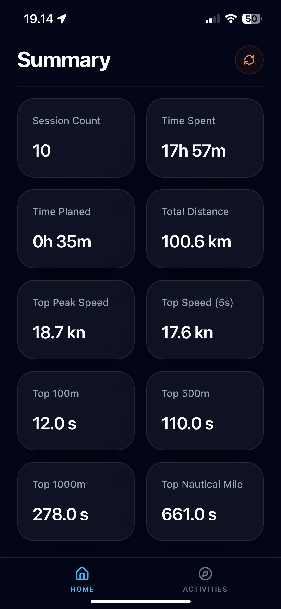
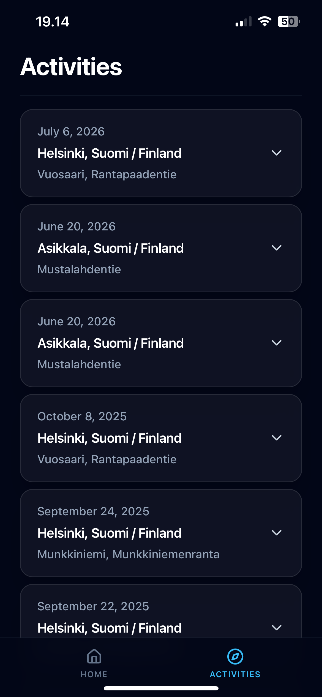
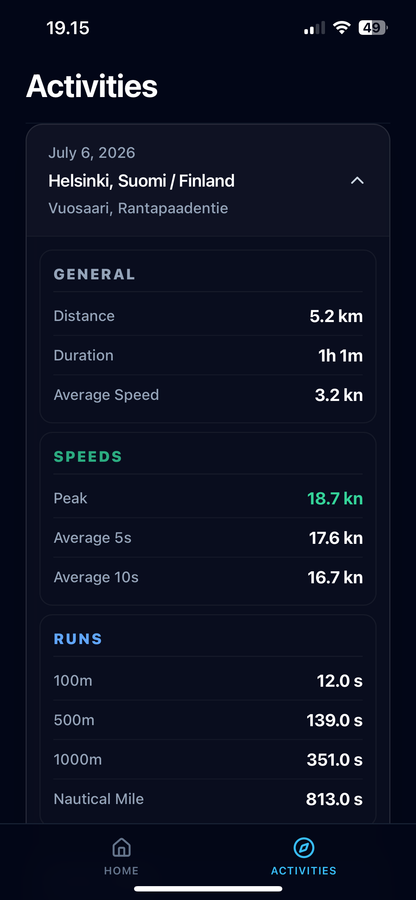

### Front-End

Progressive Web Application made with React.

Hosted on Vercel. [Windsurf-Tracker](https://windsurf-tracker-frontend.vercel.app/)

Currently only for personal use and requires dedicaded VPN connection, because the backend and database are hosted on my home lab servers.

Please check out the project repositories here:
* **Overview** [Windsurf-Tracker Overview](https://github.com/samuelms123/windsurf-tracker)
* **Backend API:** [Windsurf-Tracker Backend](https://github.com/samuelms123/windsurf-tracker-backend)

## Front-End Technologies Used

* **[React](https://react.dev/)**
* **[Vite](https://vite.dev/)**
* **[TanStack Query](https://tanstack.com/query/latest)**
* **[Tailwind CSS](https://tailwindcss.com/)**
* **[Vite PWA Plugin](https://vite-pwa-org.netlify.app/)**
* **[Fetch API](https://developer.mozilla.org/en-US/docs/Web/API/Fetch_API)**

## Screenshots

  <kbd>
    
  </kbd>
  &nbsp;&nbsp;&nbsp;&nbsp;
  <kbd>
    
  </kbd>
  &nbsp;&nbsp;&nbsp;&nbsp;
  <kbd>
    
  </kbd>
  &nbsp;&nbsp;&nbsp;&nbsp;
  <kbd>
    
  </kbd>

